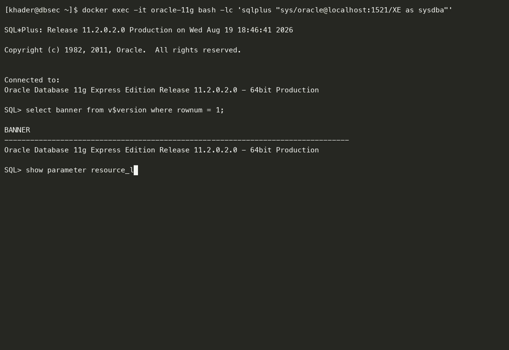
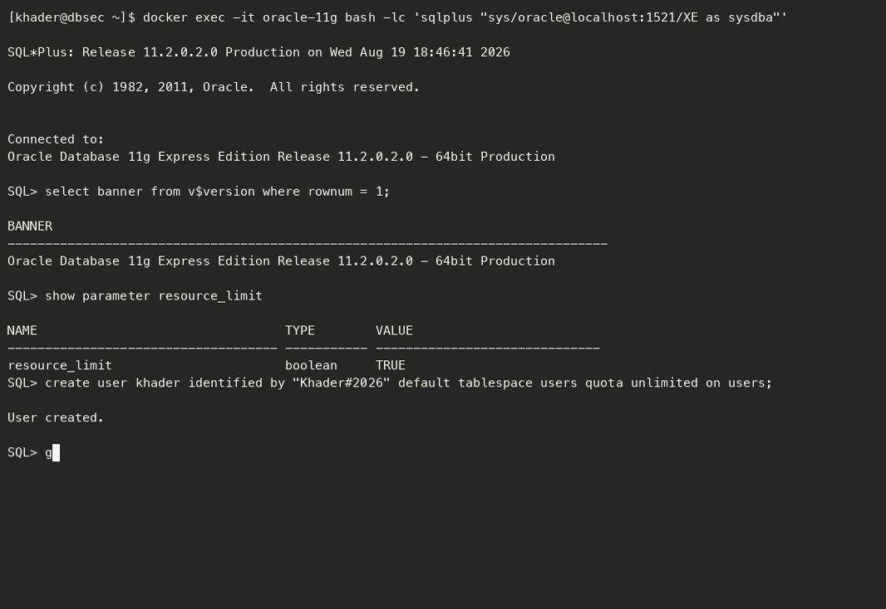
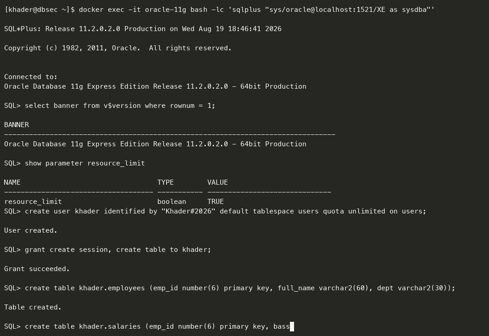
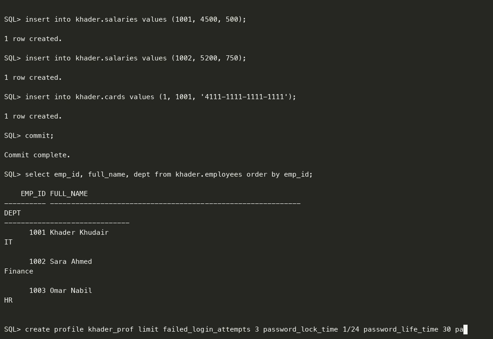
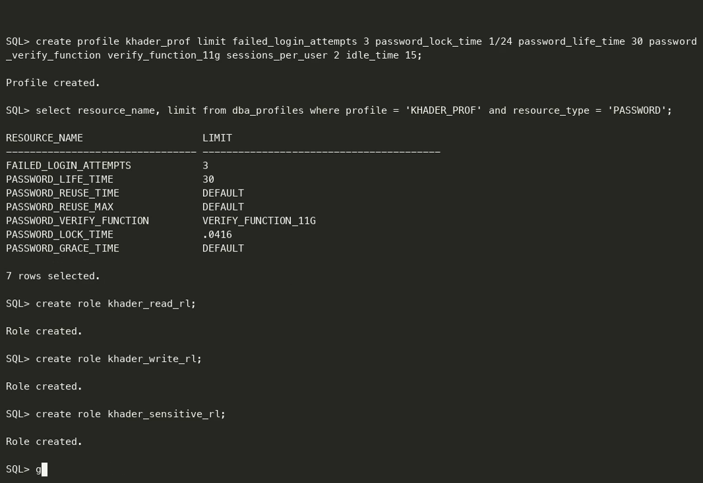
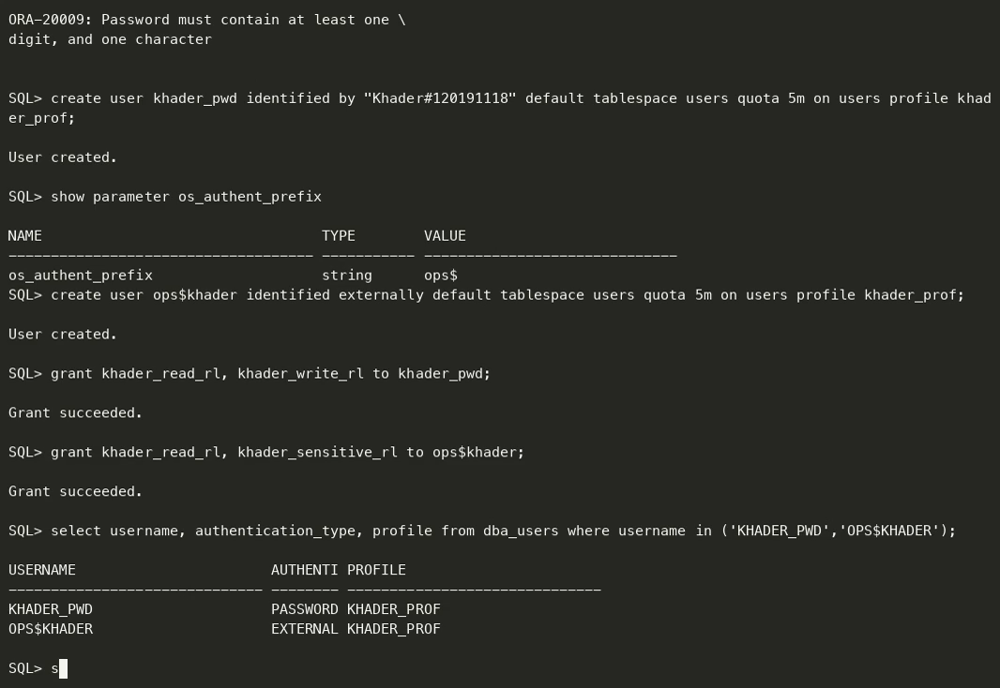
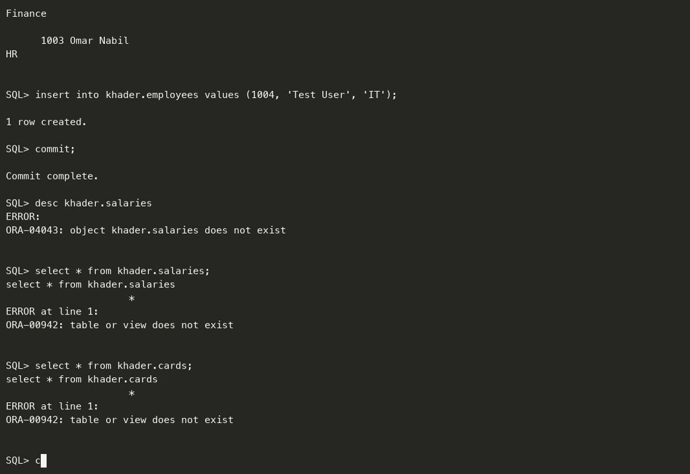
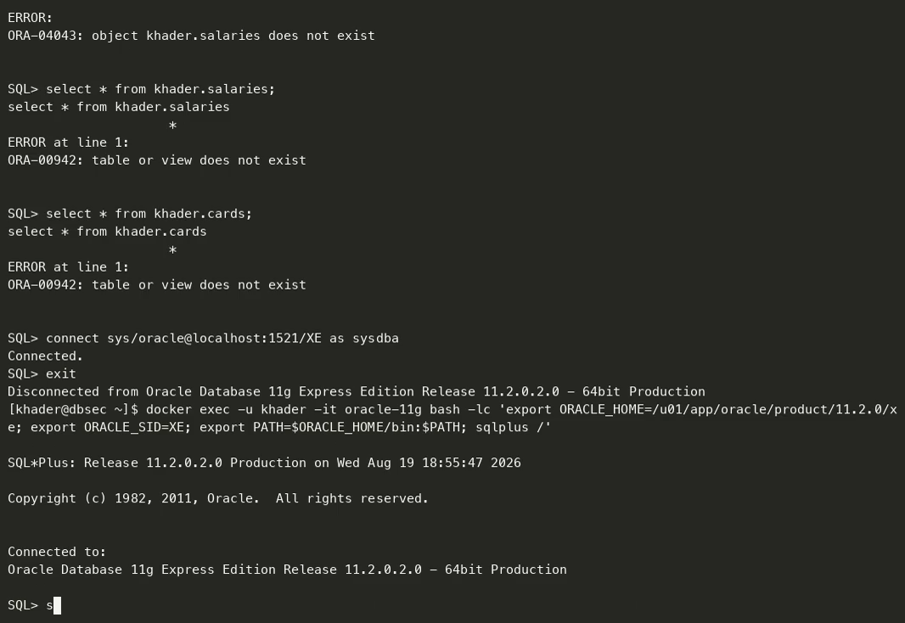

# تقرير المشروع العملي الأول
## المصادقة والتفويض — Authentication & Authorization

| | |
|---|---|
| **المقرر** | أمن قواعد البيانات — Database Security |
| **الطالب** | خضر محمد خضر خضير |
| **الرقم الجامعي** | 120191118 |
| **مدرّس المقرر** | م. أحمد شعث |
| **التاريخ** | 19 أغسطس 2026 |

---

## 1. بيئة العمل

| البند | القيمة |
|---|---|
| نظام إدارة قاعدة البيانات | Oracle Database 11g Express Edition 11.2.0.2.0 — 64bit Production |
| اسم القاعدة (SID) | `XE` |
| نظام التشغيل المُضيف | Linux x86_64 (حاوية Docker) |
| أداة الاتصال | SQL\*Plus Release 11.2.0.2.0 |
| المستخدم الإداري | `SYS AS SYSDBA` |

للتحقق من الإصدار:

```sql
SELECT banner FROM v$version WHERE rownum = 1;
```

```
BANNER
--------------------------------------------------------------------------------
Oracle Database 11g Express Edition Release 11.2.0.2.0 - 64bit Production
```



> **[لقطة شاشة 1]** — شاشة الاتصال بـ SQL\*Plus وظهور إصدار قاعدة البيانات.

---

## 2. تهيئة القاعدة قبل البدء

حدود البروفايل من نوع **Kernel/Resource** (مثل `SESSIONS_PER_USER` و`IDLE_TIME`) لا تُطبَّق فعليًا
إلا إذا كان المتغيّر `RESOURCE_LIMIT` مفعّلًا على مستوى النسخة. لذلك نبدأ بتفعيله:

```sql
ALTER SYSTEM SET resource_limit = TRUE SCOPE = BOTH;
```

```
System altered.
```

أما حدود **كلمة المرور** فهي مُطبَّقة دائمًا ولا تحتاج إلى هذا المتغيّر — وهذه نقطة مهمة في الشرح.



> **[لقطة شاشة 2]** — تنفيذ الأمر وظهور `System altered.`

---

## 3. المخطط (Schema) المستخدم للاختبار

أنشأنا مخططًا باسم `KHADER` يحتوي على ثلاثة جداول بمستويين من الحساسية، لأن التمييز بين
البيانات الحسّاسة وغير الحسّاسة هو أساس اختبار الصلاحيات:

| الجدول | مستوى الحساسية | المحتوى |
|---|---|---|
| `KHADER.EMPLOYEES` | أقل حساسية | الأسماء والأقسام والبريد |
| `KHADER.SALARIES` | الأكثر حساسية | الرواتب والمكافآت |
| `KHADER.CARDS` | الأكثر حساسية | أرقام البطاقات |

```sql
CREATE USER khader IDENTIFIED BY "Khader#2026"
  DEFAULT TABLESPACE users
  QUOTA UNLIMITED ON users;

GRANT create session, create table, create procedure, create trigger TO khader;

CREATE TABLE khader.employees (
  emp_id     NUMBER(6)    PRIMARY KEY,
  full_name  VARCHAR2(60) NOT NULL,
  dept       VARCHAR2(30),
  email      VARCHAR2(60)
);

CREATE TABLE khader.salaries (
  emp_id       NUMBER(6) PRIMARY KEY,
  base_salary  NUMBER(10,2) NOT NULL,
  bonus        NUMBER(10,2)
);

CREATE TABLE khader.cards (
  card_id   NUMBER(6) PRIMARY KEY,
  emp_id    NUMBER(6),
  card_no   VARCHAR2(19),
  cvv       VARCHAR2(4)
);
```

> **ملاحظة عملية مهمة:** بعد تثبيت دالة فحص كلمة المرور (الخطوة 4) لم يعد مقبولًا إنشاء مستخدم
> بكلمة مرور بسيطة. محاولة `IDENTIFIED BY khader` تُنتج:
> ```
> ORA-28003: password verification for the specified password failed
> ORA-20001: Password length less than 8
> ```
> لذلك استُخدمت كلمة مرور تحقّق الشروط: 8 محارف فأكثر، وتحتوي حرفًا ورقمًا ورمزًا.



> **[لقطة شاشة 3]** — إنشاء المخطط والجداول وإدخال البيانات التجريبية.

---

## 4. البروفايل (Profile) — المتطلب الرابع

### 4.1 ما هو البروفايل وكيف يعمل؟

البروفايل هو **مجموعة مُسمّاة من القيود** تُربط بالمستخدم، وتنقسم إلى نوعين:

1. **قيود كلمة المرور (Password Limits):** مثل عدد محاولات الدخول الفاشلة ومدة صلاحية كلمة
   المرور وقواعد التعقيد. **تُطبَّق دائمًا.**
2. **قيود الموارد (Kernel/Resource Limits):** مثل عدد الجلسات المتزامنة ومدة الخمول.
   **لا تُطبَّق إلا إذا كان `RESOURCE_LIMIT = TRUE`** — وهذا هو جواب سؤال «كيفية تفعيله».

### 4.2 تثبيت دالة فحص تعقيد كلمة المرور

أوراكل توفّر السكربت الجاهز `utlpwdmg.sql` الذي يُنشئ الدالة `VERIFY_FUNCTION_11G`:

```sql
@?/rdbms/admin/utlpwdmg.sql
```

```
Function created.
Profile altered.
Function created.
```

### 4.3 إنشاء البروفايل

```sql
CREATE PROFILE khader_prof LIMIT
  -- قيود كلمة المرور
  failed_login_attempts     3
  password_lock_time        1/24
  password_life_time        30
  password_grace_time       3
  password_reuse_max        5
  password_reuse_time       30
  password_verify_function  verify_function_11g
  -- قيود الموارد (تحتاج RESOURCE_LIMIT = TRUE)
  sessions_per_user         2
  idle_time                 15
  connect_time              120
  logical_reads_per_session 100000;
```

```
Profile created.
```

| القيد | القيمة | المعنى |
|---|---|---|
| `FAILED_LOGIN_ATTEMPTS` | 3 | يُقفل الحساب بعد 3 محاولات دخول خاطئة |
| `PASSWORD_LOCK_TIME` | 1/24 | يبقى مقفلًا لمدة ساعة |
| `PASSWORD_LIFE_TIME` | 30 | تنتهي صلاحية كلمة المرور بعد 30 يومًا |
| `PASSWORD_REUSE_MAX` | 5 | لا يمكن إعادة استخدام كلمة المرور قبل 5 كلمات أخرى |
| `SESSIONS_PER_USER` | 2 | جلستان متزامنتان كحد أقصى |
| `IDLE_TIME` | 15 | إنهاء الجلسة الخاملة بعد 15 دقيقة |



> **[لقطة شاشة 4]** — إنشاء البروفايل وظهور `Profile created.`

---

## 5. الأدوار (Roles) — المتطلب الثالث

طُبّق مبدأ **الحد الأدنى من الصلاحيات (Least Privilege)** بتقسيم الصلاحيات على ثلاثة أدوار
منفصلة، بدلًا من منح كل شيء لدور واحد:

```sql
CREATE ROLE khader_read_rl;
CREATE ROLE khader_write_rl;
CREATE ROLE khader_sensitive_rl;

GRANT create session                       TO khader_read_rl;
GRANT SELECT ON khader.employees           TO khader_read_rl;

GRANT INSERT, UPDATE, DELETE ON khader.employees TO khader_write_rl;

GRANT SELECT ON khader.salaries            TO khader_sensitive_rl;
GRANT SELECT ON khader.cards               TO khader_sensitive_rl;
```

```
Role created.
Role created.
Role created.
Grant succeeded.
...
```

| الدور | الصلاحيات |
|---|---|
| `KHADER_READ_RL` | `CREATE SESSION` + قراءة الجدول غير الحسّاس |
| `KHADER_WRITE_RL` | تعديل الجدول غير الحسّاس |
| `KHADER_SENSITIVE_RL` | قراءة الجداول الحسّاسة |

> **تنبيه عملي:** يجب عدم وضع تعليق `--` بعد الفاصلة المنقوطة في السطر نفسه داخل SQL\*Plus،
> لأن الأداة تتجاهل الأمر بالكامل دون إظهار أي خطأ.



> **[لقطة شاشة 5]** — إنشاء الأدوار ومنح الصلاحيات.

---

## 6. المستخدمون — المتطلبان الأول والثاني

### 6.1 مستخدم يعتمد على كلمة المرور (Password Authentication)

أوراكل هي التي تتحقق من الهوية، وتُخزَّن بصمة كلمة المرور داخل القاعدة:

```sql
CREATE USER khader_pwd IDENTIFIED BY "Khader#120191118"
  DEFAULT TABLESPACE users
  QUOTA 5M ON users
  PROFILE khader_prof;
```

```
User created.
```

> **سبب اختيار كلمة المرور:** أردنا استخدام الرقم الجامعي `120191118` ككلمة مرور، لكن دالة
> `VERIFY_FUNCTION_11G` المرتبطة بالبروفايل ترفض كلمة مرور مكوّنة من أرقام فقط، لأنها تشترط
> وجود **حرف ورقم ورمز** معًا وطولًا لا يقلّ عن 8 محارف. لذلك أصبحت كلمة المرور
> `Khader#120191118`، وهي تحتوي الرقم الجامعي وتحقّق شروط التعقيد في الوقت نفسه.
> وهذا في حدّ ذاته **دليلٌ عملي** على أن قيود كلمة المرور في البروفايل مُطبَّقة فعلًا.

### 6.2 مستخدم يعتمد على المصادقة الخارجية (External / OS Authentication)

هنا **تثق** أوراكل بنظام التشغيل في التحقق من هوية المستخدم، فلا تُخزَّن كلمة مرور في القاعدة
ولا تُكتب عند الدخول. شرط التسمية: اسم المستخدم في أوراكل = `OS_AUTHENT_PREFIX` + اسم مستخدم النظام.

```sql
SHOW PARAMETER os_authent_prefix
```

```
NAME                 TYPE        VALUE
-------------------- ----------- ------
os_authent_prefix    string      ops$
```

وبما أن حساب نظام التشغيل هو `khader`، يصبح اسم المستخدم في أوراكل `OPS$KHADER`:

```bash
# على مستوى نظام التشغيل (داخل الحاوية)
useradd -m khader
```

```sql
CREATE USER ops$khader IDENTIFIED EXTERNALLY
  DEFAULT TABLESPACE users
  QUOTA 5M ON users
  PROFILE khader_prof;
```

```
User created.
```

> **ملاحظة أمنية مقصودة:** لم يُضَف حساب النظام `khader` إلى المجموعة `dba`، لأن العضوية في تلك
> المجموعة تتيح الدخول بـ `sqlplus / AS SYSDBA` وتتجاوز نموذج الصلاحيات بالكامل. وصلاحية التنفيذ
> على `sqlplus` متاحة أصلًا لجميع المستخدمين (`-rwxr-x--x`).

### 6.3 ربط المستخدمين بالأدوار — المتطلب الخامس

```sql
GRANT khader_read_rl  TO khader_pwd;
GRANT khader_write_rl TO khader_pwd;

GRANT khader_read_rl      TO ops$khader;
GRANT khader_sensitive_rl TO ops$khader;
```

**لاحظ الفرق المقصود:** المستخدم `khader_pwd` **لم يُمنح** الدور `khader_sensitive_rl`،
وهو ما سيُستخدم لإثبات فشل العمليات غير المصرّح بها.

### 6.4 التحقق من نوع المصادقة لكل مستخدم

```sql
SELECT username, authentication_type, profile, account_status
  FROM dba_users
 WHERE username IN ('KHADER_PWD','OPS$KHADER');
```

```
USERNAME        AUTHENTICATION_TYPE  PROFILE       ACCOUNT_STATUS
--------------- -------------------- ------------- --------------
KHADER_PWD      PASSWORD             KHADER_PROF   OPEN
OPS$KHADER      EXTERNAL             KHADER_PROF   OPEN
```

هذا المخرج يثبت المتطلبين الأول والثاني في سطرين: مستخدم `PASSWORD` ومستخدم `EXTERNAL`،
وكلاهما مرتبط بالبروفايل `KHADER_PROF`.

```sql
SELECT grantee, granted_role
  FROM dba_role_privs
 WHERE grantee IN ('KHADER_PWD','OPS$KHADER')
 ORDER BY grantee;
```

```
GRANTEE         GRANTED_ROLE
--------------- ---------------------
KHADER_PWD      KHADER_READ_RL
KHADER_PWD      KHADER_WRITE_RL
OPS$KHADER      KHADER_READ_RL
OPS$KHADER      KHADER_SENSITIVE_RL
```



> **[لقطة شاشة 6]** — إنشاء المستخدمين وربطهما بالأدوار ونتيجة استعلام `DBA_USERS`.

---

## 7. اختبار الصلاحيات — المتطلب السادس

### 7.1 نجاح العمليات المسموح بها

```sql
CONNECT khader_pwd/"Khader#120191118"@localhost:1521/XE
SHOW USER
```

```
Connected.
USER is "KHADER_PWD"
```

```sql
SELECT emp_id, full_name, dept FROM khader.employees ORDER BY emp_id;
```

```
    EMP_ID FULL_NAME            DEPT
---------- -------------------- ----------
      1001 Khader Khudair       IT
      1002 Sara Ahmed           Finance
      1003 Omar Nabil           HR
```

```sql
INSERT INTO khader.employees VALUES (1004, 'Test User', 'IT', 'test@ucas.edu.ps');
COMMIT;
```

```
1 row created.
Commit complete.
```

✅ القراءة والإضافة نجحتا لأن المستخدم يملك `KHADER_READ_RL` و`KHADER_WRITE_RL`.

### 7.2 فشل العمليات غير المصرّح بها

```sql
SELECT * FROM khader.salaries;
```

```
SELECT * FROM khader.salaries
                     *
ERROR at line 1:
ORA-00942: table or view does not exist
```

```sql
SELECT * FROM khader.cards;
```

```
ORA-00942: table or view does not exist
```

❌ فشلت العمليتان كما هو متوقّع.

> **نقطة جوهرية للمناقشة:** الخطأ هو `ORA-00942` («الجدول غير موجود») وليس «ليس لديك صلاحية».
> وهذا سلوك أمني مقصود من أوراكل: فهي **تُخفي وجود الكائن** عمّن لا يملك صلاحية عليه، حتى لا
> يستنتج المهاجم أسماء الجداول الحسّاسة من رسائل الخطأ.

### 7.3 إثبات المصادقة الخارجية — الدخول بدون كلمة مرور

```bash
# الدخول بحساب نظام التشغيل khader ثم تشغيل SQL*Plus بشرطة مائلة فقط
sqlplus /
```

```sql
SHOW USER
```

```
USER is "OPS$KHADER"
```

```sql
SELECT emp_id, base_salary FROM khader.salaries ORDER BY emp_id;
```

```
    EMP_ID BASE_SALARY
---------- -----------
      1001        4500
      1002        5200
      1003        3900
```

✅ تم الدخول **دون إدخال أي كلمة مرور لأوراكل**، ونجح الوصول إلى الجدول الحسّاس لأن هذا
المستخدم — وحده — يملك الدور `KHADER_SENSITIVE_RL`.



> **[لقطة شاشة 7]** — الدخول بالمصادقة الخارجية وظهور `USER is "OPS$KHADER"`.


> **[لقطة شاشة 8]** — فشل الوصول غير المصرّح به بالخطأ `ORA-00942`.

---

## 8. الخلاصة

| المتطلب | الحالة | الدليل |
|---|---|---|
| مستخدم بمصادقة خارجية | ✅ | `OPS$KHADER` — `AUTHENTICATION_TYPE = EXTERNAL` |
| مستخدم بكلمة مرور | ✅ | `KHADER_PWD` — `AUTHENTICATION_TYPE = PASSWORD` |
| أدوار وصلاحيات مناسبة | ✅ | ثلاثة أدوار حسب مبدأ الحد الأدنى من الصلاحيات |
| بروفايل مع شرح آلية التفعيل | ✅ | `KHADER_PROF` + `RESOURCE_LIMIT = TRUE` |
| ربط المستخدمين بالأدوار | ✅ | `DBA_ROLE_PRIVS` |
| نجاح المسموح وفشل الممنوع | ✅ | `SELECT`/`INSERT` نجحا، و`ORA-00942` للممنوع |

**ملاحظات ختامية:**

- استخدام `ORA-00942` بدل رسالة «لا تملك صلاحية» هو إخفاء متعمّد لوجود الكائنات الحسّاسة.
- الفصل بين قيود كلمة المرور (تعمل دائمًا) وقيود الموارد (تحتاج `RESOURCE_LIMIT=TRUE`) هو
  أكثر ما يُسأل عنه في هذا المشروع.
- عدم إضافة حساب النظام إلى مجموعة `dba` قرار أمني مقصود وليس إغفالًا.
