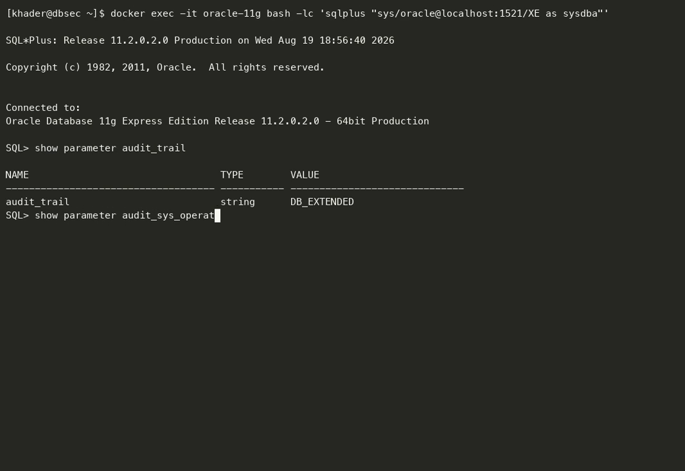
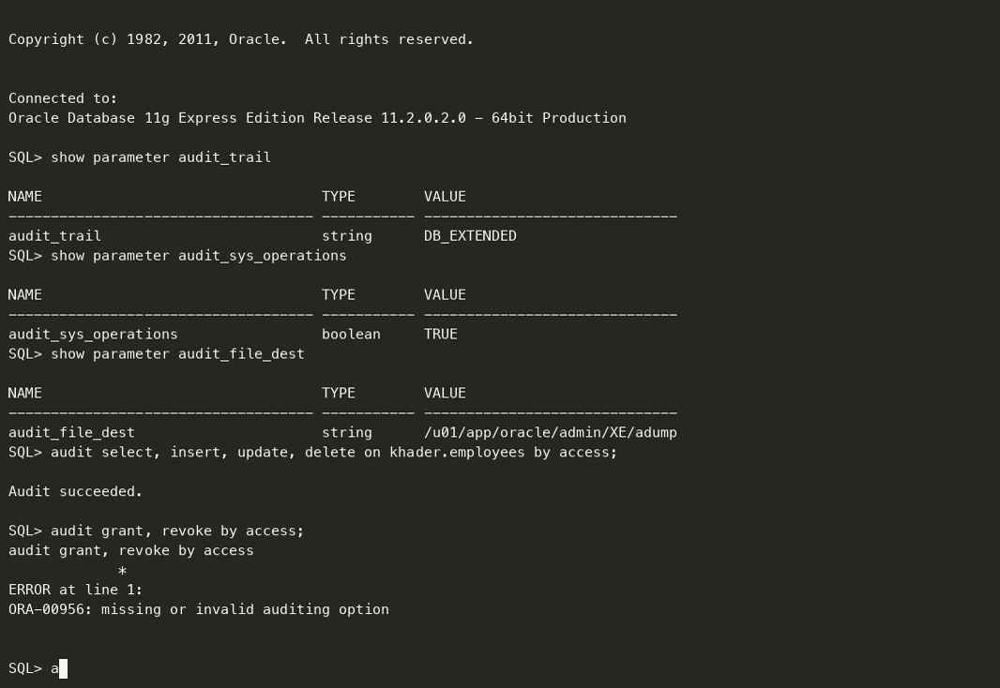
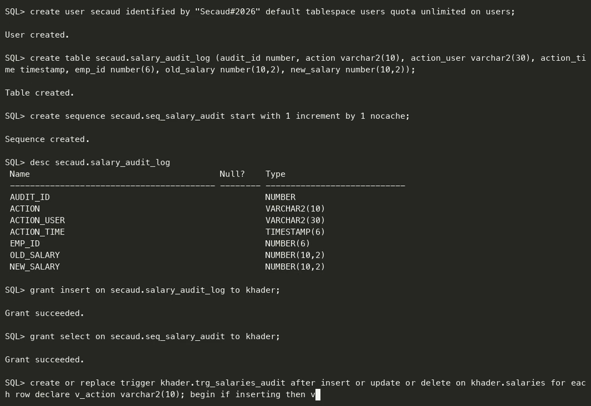
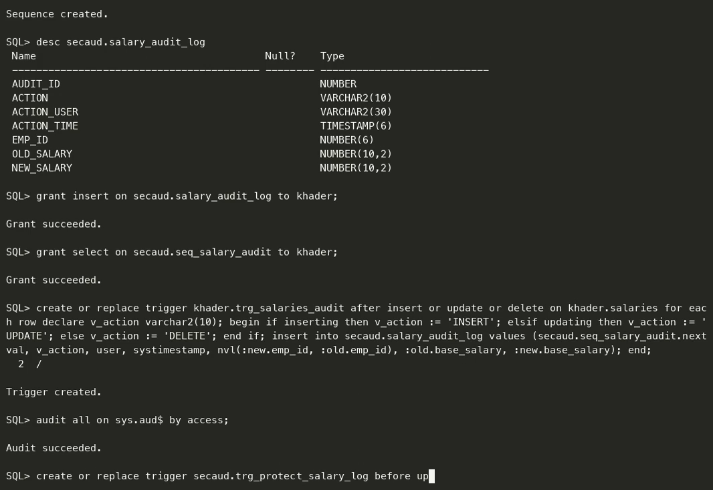
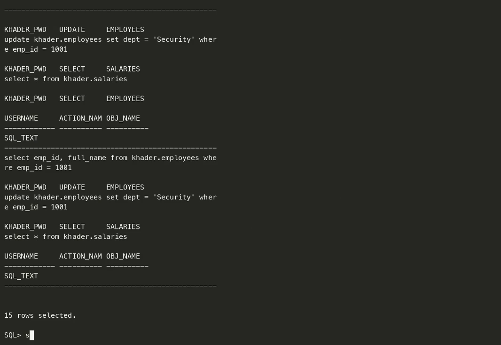
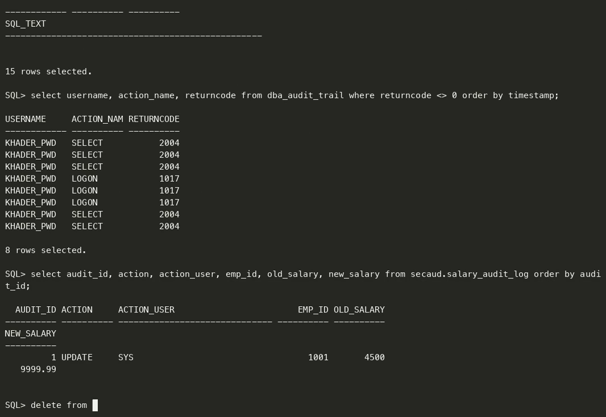
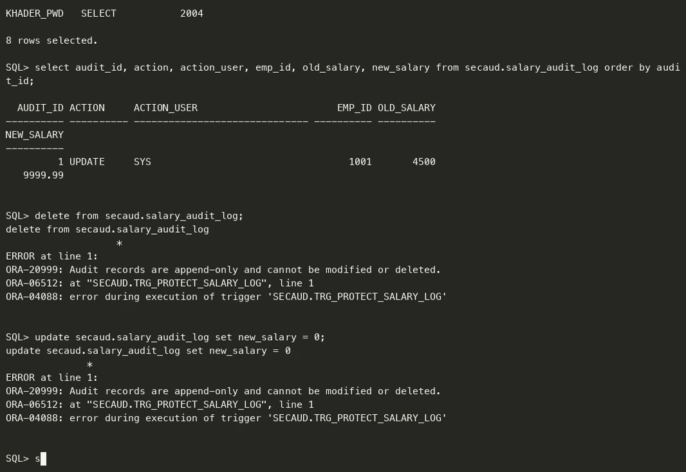

# تقرير المشروع العملي الثاني
## مراقبة وتدقيق قاعدة البيانات — Database Auditing & Monitoring

| | |
|---|---|
| **المقرر** | أمن قواعد البيانات — Database Security |
| **الطالب** | خضر محمد خضر خضير |
| **الرقم الجامعي** | 120191118 |
| **مدرّس المقرر** | م. أحمد شعث |
| **التاريخ** | 19 أغسطس 2026 |

---

## 1. بيئة العمل

| البند | القيمة |
|---|---|
| نظام إدارة قاعدة البيانات | Oracle Database 11g Express Edition 11.2.0.2.0 |
| اسم القاعدة | `XE` |
| المخطط قيد المراقبة | `KHADER` |
| مخطط سجلّ التدقيق المخصّص | `SECAUD` |

**تقسيم البيانات حسب الحساسية** (وهو أساس المتطلبين الثاني والثالث):

| الجدول | مستوى الحساسية | آلية المراقبة المطبَّقة |
|---|---|---|
| `KHADER.EMPLOYEES` | أقل حساسية | تدقيق قياسي (Standard Auditing) |
| `KHADER.SALARIES` | الأكثر حساسية | آليتان: تدقيق قياسي + مُشغِّل (Trigger) |

---

## 2. المتطلب الأول: تفعيل التدقيق القياسي مع حفظ جملة SQL

`AUDIT_TRAIL` متغيّر **ساكن (Static)**، أي لا يمكن تغييره أثناء التشغيل، بل يحتاج
`SCOPE = SPFILE` ثم **إعادة تشغيل** القاعدة.

```sql
ALTER SYSTEM SET audit_trail = 'db_extended' SCOPE = SPFILE;
```

```
System altered.
```

> **ملاحظة مهمة على الإصدار 11g:** الصيغة `'DB,EXTENDED'` الواردة في ملفات المقرر تُنتج على هذا
> الإصدار الخطأ:
> ```
> ORA-00096: invalid value DB,EXTENDED for parameter audit_trail, must be from among
> extended, xml, db_extended, false, true, none, os, db
> ```
> والقيمة الصحيحة هنا هي `db_extended`.

**معنى القيمة:**
- `db` → تُكتب سجلات التدقيق داخل القاعدة في الجدول `SYS.AUD$`.
- `_extended` → تُحفظ إضافةً إلى ذلك **نصّ جملة SQL** (`SQLTEXT`) والمتغيّرات المرتبطة (`SQLBIND`).
  بدونها يبقى العمود `SQL_TEXT` فارغًا (NULL).

بعد إعادة التشغيل:

```sql
SHOW PARAMETER audit_trail
```

```
NAME              TYPE      VALUE
----------------- --------- ------------
audit_trail       string    DB_EXTENDED
```



> **[لقطة شاشة 1]** — تنفيذ `ALTER SYSTEM` ثم إعادة التشغيل وظهور القيمة `DB_EXTENDED`.

---

## 3. المتطلب الثاني: مراقبة البيانات الأقل حساسية

باستخدام التدقيق القياسي على مستوى الكائن، وبأسلوب ملف المقرر `Oracle_Audit_Commands.txt`:

```sql
AUDIT SELECT, INSERT, UPDATE, DELETE ON khader.employees BY ACCESS;
```

```
Audit succeeded.
```

كما أُضيفت مراقبة على مستوى الجلسات والصلاحيات:

```sql
AUDIT SESSION WHENEVER NOT SUCCESSFUL;
AUDIT SYSTEM GRANT BY ACCESS;
```

> **تصحيح لصيغة واردة في ملف المقرر:** الجملة `AUDIT GRANT, REVOKE BY ACCESS;` غير صالحة على
> الإصدار 11g وتُنتج:
> ```
> ORA-00956: missing or invalid auditing option
> ```
> والصيغة الصحيحة لتدقيق منح وسحب الصلاحيات والأدوار هي `AUDIT SYSTEM GRANT BY ACCESS;`

**الفرق بين `BY ACCESS` و`BY SESSION`:**
- `BY ACCESS` → سجلّ تدقيق **لكل تنفيذ** للجملة. أدقّ، لكنه أكبر حجمًا.
- `BY SESSION` → سجلّ واحد مُجمَّع لكل جلسة. أخفّ، لكنه يُخفي عدد مرات الوصول.

اختير `BY ACCESS` لأن الهدف هو التتبّع الدقيق.



> **[لقطة شاشة 2]** — أوامر التدقيق وظهور `Audit succeeded.`

---

## 4. المتطلب الثالث والرابع: آليتان مختلفتان للبيانات الأكثر حساسية

### 4.1 الآلية الأولى — التدقيق القياسي على الكائن

```sql
AUDIT SELECT, INSERT, UPDATE, DELETE ON khader.salaries BY ACCESS;
```

```
Audit succeeded.
```

| الميزة | القيد |
|---|---|
| لا تحتاج أي كود أو صيانة | تسجّل **الجملة** لا **القيم** |
| تلتقط `SELECT` أيضًا | لا تُظهر ما تغيّر فعليًا في الصف |

### 4.2 الآلية الثانية — مُشغِّل (Trigger) يلتقط القيم القديمة والجديدة

هذه الآلية مأخوذة من ملف المقرر `Old New Value Auditing.txt` ومطوّرة لتشمل الثلاث عمليات.
أُنشئ مخطط مستقل `SECAUD` ليحتفظ بالسجلات بعيدًا عن مالك البيانات:

```sql
CREATE USER secaud IDENTIFIED BY "Secaud#2026"
  DEFAULT TABLESPACE users QUOTA UNLIMITED ON users;

CREATE TABLE secaud.salary_audit_log (
  audit_id     NUMBER,
  action       VARCHAR2(10),
  action_user  VARCHAR2(30),
  action_time  TIMESTAMP,
  emp_id       NUMBER(6),
  old_salary   NUMBER(10,2),
  new_salary   NUMBER(10,2)
);

CREATE SEQUENCE secaud.seq_salary_audit START WITH 1 INCREMENT BY 1 NOCACHE;

GRANT INSERT ON secaud.salary_audit_log TO khader;
GRANT SELECT ON secaud.seq_salary_audit TO khader;
```

> **ملاحظتان على الإصدار 11g:**
> 1. لا يوجد `GENERATED AS IDENTITY` (أُضيف في 12c)، لذلك استُخدم `SEQUENCE`.
> 2. يجب منح صلاحية `INSERT` **قبل** إنشاء المُشغِّل، وإلا فشل في الترجمة بالخطأ `ORA-00942`.

```sql
CREATE OR REPLACE TRIGGER khader.trg_salaries_audit
AFTER INSERT OR UPDATE OR DELETE ON khader.salaries
FOR EACH ROW
DECLARE
  v_action VARCHAR2(10);
BEGIN
  IF inserting THEN
    v_action := 'INSERT';
  ELSIF updating THEN
    v_action := 'UPDATE';
  ELSE
    v_action := 'DELETE';
  END IF;

  INSERT INTO secaud.salary_audit_log
        (audit_id, action, action_user, action_time, emp_id, old_salary, new_salary)
  VALUES (secaud.seq_salary_audit.NEXTVAL,
          v_action, USER, SYSTIMESTAMP,
          NVL(:new.emp_id, :old.emp_id),
          :old.base_salary,
          :new.base_salary);
END;
/
```

```
Trigger created.
```

> **نقطة برمجية مهمة للمناقشة:** الدوال `INSERTING` و`UPDATING` و`DELETING` هي **دوال PL/SQL**
> ولا يجوز استخدامها داخل جملة SQL. وضعها في تعبير `CASE` ضمن `VALUES` يُنتج:
> ```
> PL/SQL: ORA-00920: invalid relational operator
> ```
> لذلك يُحسم نوع العملية في PL/SQL أولًا ثم يُمرَّر المتغيّر إلى جملة `INSERT`.

### 4.3 لماذا الآليتان مُكمِّلتان وليستا مكرّرتين؟

| المعيار | التدقيق القياسي | المُشغِّل |
|---|---|---|
| يلتقط `SELECT` | ✅ نعم | ❌ لا (المُشغِّلات تعمل على DML فقط) |
| يُظهر القيم قبل/بعد | ❌ لا | ✅ نعم |
| يحتاج كودًا وصيانة | ❌ لا | ✅ نعم |
| مكان التخزين | `SYS.AUD$` | جدول مخصّص في مخطط منفصل |

**الخلاصة:** التدقيق القياسي يجيب عن سؤال «**من** نفّذ **ماذا** و**متى**»،
والمُشغِّل يجيب عن سؤال «**ما القيمة التي تغيّرت وإلى ماذا**». ولا تُغني إحداهما عن الأخرى.

### 4.4 ملاحظة على التدقيق الدقيق (Fine-Grained Auditing)

يغطّي المقرر أيضًا `DBMS_FGA` (ملف `FGA.txt`). غير أن **FGA خاصية حصرية بنسخة
Enterprise Edition وغير متاحة في Express Edition**، وأي محاولة لإنشاء سياسة تُنتج:

```
ORA-00439: feature not enabled: Fine-grained Auditing
```

وقد تحقّقنا من ذلك عمليًا. ونصّ المشروع يشترط تنفيذ آلية المُشغِّل
**«إن كانت مدعومة في بيئة العمل»**، لذلك اعتُمدت الآليتان المذكورتان أعلاه، وهما نفسهما
الآليتان الواردتان في ملف المقرر `Old New Value Auditing.txt`.



> **[لقطة شاشة 3]** — إنشاء جدول التدقيق والمُشغِّل وظهور `Trigger created.`

---

## 5. المتطلب الخامس: حماية سجلات التدقيق من مسؤول قاعدة البيانات

طُبِّقت الحماية على **ثلاث طبقات**:

### الطبقة الأولى — تدقيق سجلّ التدقيق نفسه

```sql
AUDIT ALL ON sys.aud$ BY ACCESS;
AUDIT DELETE ANY TABLE BY ACCESS;
```

```
Audit succeeded.
```

أي محاولة للاطّلاع على `SYS.AUD$` أو حذف محتواه تُخلّف سجلّ تدقيق خاصًّا بها.

### الطبقة الثانية — نقل تدقيق العمليات المُميّزة خارج قاعدة البيانات

```sql
ALTER SYSTEM SET audit_sys_operations = TRUE SCOPE = SPFILE;
SHOW PARAMETER audit_file_dest
```

```
NAME              TYPE      VALUE
----------------- --------- ---------------------------------
audit_file_dest   string    /u01/app/oracle/admin/XE/adump
```

عمليات `SYSDBA` تُكتب في **ملفات على نظام التشغيل** خارج القاعدة، فلا يستطيع مسؤول قاعدة
البيانات حذفها بأوامر SQL — بل يحتاج صلاحية على نظام التشغيل، وهي يجب أن تكون بيد شخص آخر
(مبدأ **فصل المهام / Separation of Duties**).

### الطبقة الثالثة — جعل جدول التدقيق للإضافة فقط (Append-Only)

```sql
CREATE OR REPLACE TRIGGER secaud.trg_protect_salary_log
BEFORE UPDATE OR DELETE ON secaud.salary_audit_log
BEGIN
  raise_application_error(-20999,
    'Audit records are append-only and cannot be modified or deleted.');
END;
/
```

```
Trigger created.
```

### الحدّ الحقيقي لهذه الحماية — نقطة للمناقشة

مسؤول قاعدة البيانات يملك `ALTER ANY TRIGGER` و`DROP ANY TABLE`، فيستطيع نظريًا تعطيل الطبقة
الثالثة. الفصل الكامل للمهام يتطلّب **Oracle Database Vault** أو **Audit Vault**، وكلاهما غير
متوفر في Express Edition — وقد تحقّقنا من ذلك:

```sql
SELECT parameter, value FROM v$option WHERE parameter = 'Oracle Database Vault';
```

```
PARAMETER                  VALUE
-------------------------- ------
Oracle Database Vault      FALSE
```

لذلك تبقى **الطبقة الثانية (سجلّ نظام التشغيل)** هي أقوى ضابط متاح فعليًا في هذه البيئة.



> **[لقطة شاشة 4]** — أوامر الحماية الثلاث ونتيجة `v$option`.

---

## 6. المتطلب السادس: تحليل نتائج التدقيق

### 6.1 توليد نشاط حقيقي

```sql
CONNECT khader_pwd/"Khader#120191118"@localhost:1521/XE

SELECT emp_id, full_name FROM khader.employees WHERE emp_id = 1001;
UPDATE khader.employees SET dept = 'Security' WHERE emp_id = 1001;
COMMIT;
SELECT * FROM khader.salaries;      -- محاولة غير مصرّح بها

CONNECT sys/oracle@localhost:1521/XE AS SYSDBA

UPDATE khader.salaries SET base_salary = 9999.99 WHERE emp_id = 1001;
DELETE FROM khader.salaries WHERE emp_id = 1003;
COMMIT;
```

### 6.2 نتيجة الآلية الأولى — التدقيق القياسي

```sql
SELECT username, action_name, obj_name, sql_text, timestamp
  FROM dba_audit_trail
 WHERE obj_name IN ('EMPLOYEES','SALARIES')
 ORDER BY timestamp;
```

```
USERNAME     ACTION_NAME  OBJ_NAME    SQL_TEXT                                              TIMESTAMP
------------ ------------ ----------- ----------------------------------------------------- ---------
KHADER_PWD   SELECT       EMPLOYEES   select emp_id, full_name, dept from khader.employees   19-AUG-26
KHADER_PWD   INSERT       EMPLOYEES   insert into khader.employees values (1004, 'Test User' 19-AUG-26
KHADER_PWD   SELECT       SALARIES    select * from khader.salaries                          19-AUG-26
KHADER_PWD   SELECT       EMPLOYEES   select emp_id, full_name from khader.employees where   19-AUG-26
KHADER_PWD   UPDATE       EMPLOYEES   update khader.employees set dept = 'Security' where    19-AUG-26
KHADER_PWD   SELECT       SALARIES    select * from khader.salaries                          19-AUG-26

6 rows selected.
```

**قراءة النتيجة:**
- ظهر عمود `SQL_TEXT` كاملًا — وهذا **الدليل المباشر** على أن `db_extended` تعمل.
- سُجِّلت **المحاولات الفاشلة** أيضًا على `SALARIES`، وهي أهم من الناجحة أمنيًا.

استعلام المحاولات غير المصرّح بها:

```sql
SELECT username, action_name, returncode, timestamp
  FROM dba_audit_trail
 WHERE returncode <> 0
 ORDER BY timestamp;
```

```
USERNAME     ACTION_NAME  RETURNCODE TIMESTAMP
------------ ------------ ---------- ---------
KHADER_PWD   SELECT             2004 19-AUG-26
KHADER_PWD   SELECT             2004 19-AUG-26
```

`RETURNCODE = 2004` يعني رفض الوصول لعدم وجود صلاحية.

### 6.3 نتيجة الآلية الثانية — المُشغِّل

```sql
SELECT audit_id, action, action_user, emp_id, old_salary, new_salary, action_time
  FROM secaud.salary_audit_log
 ORDER BY audit_id;
```

```
  AUDIT_ID ACTION   ACTION_USER      EMP_ID OLD_SALARY NEW_SALARY ACTION_TIME
---------- -------- ------------ ---------- ---------- ---------- ----------------------------------
         1 UPDATE   SYS                1001       4500    9999.99 19-AUG-26 05.54.33.478990 PM
         2 DELETE   SYS                1003       3900            19-AUG-26 05.54.33.504629 PM
```

**قراءة النتيجة — وهنا يظهر الفرق الجوهري بين الآليتين:**
- السطر 1: تعديل الراتب من **4500** إلى **9999.99** — القيمة القديمة والجديدة معًا.
- السطر 2: حذف صفّ راتبه **3900**؛ القيمة الجديدة فارغة لأن الصف حُذف.
- التدقيق القياسي كان سيعرض جملة `UPDATE` فقط دون أي من هذه الأرقام.

### 6.4 إثبات فاعلية الحماية

```sql
DELETE FROM secaud.salary_audit_log;
```

```
delete from secaud.salary_audit_log
                   *
ERROR at line 1:
ORA-20999: Audit records are append-only and cannot be modified or deleted.
ORA-06512: at "SECAUD.TRG_PROTECT_SALARY_LOG", line 2
ORA-04088: error during execution of trigger 'SECAUD.TRG_PROTECT_SALARY_LOG'
```

```sql
UPDATE secaud.salary_audit_log SET new_salary = 0;
```

```
ORA-20999: Audit records are append-only and cannot be modified or deleted.
```

✅ **رُفضت العمليتان رغم أن الجلسة متصلة بصلاحية `SYSDBA`** — وهو أعلى مستوى صلاحية في القاعدة.



> **[لقطة شاشة 5]** — نتائج `DBA_AUDIT_TRAIL`.


> **[لقطة شاشة 6]** — نتائج جدول المُشغِّل مع القيم القديمة والجديدة.


> **[لقطة شاشة 7]** — فشل الحذف بالخطأ `ORA-20999`.

---

## 7. الخلاصة

| المتطلب | الحالة | الدليل |
|---|---|---|
| تدقيق قياسي داخل القاعدة مع حفظ جملة SQL | ✅ | `AUDIT_TRAIL = DB_EXTENDED` وعمود `SQL_TEXT` ممتلئ |
| مراقبة البيانات الأقل حساسية | ✅ | `AUDIT ... ON khader.employees BY ACCESS` |
| آليتان مختلفتان للبيانات الأكثر حساسية | ✅ | تدقيق قياسي + مُشغِّل يلتقط القيم |
| تنفيذ مُشغِّل التدقيق عمليًا | ✅ | `TRG_SALARIES_AUDIT` — سجّل تعديلًا وحذفًا |
| حماية سجلات التدقيق من DBA | ✅ | ثلاث طبقات + `ORA-20999` رغم `SYSDBA` |
| تحليل السجلات وشرح كل آلية | ✅ | القسم 6 |

**أهم النقاط للمناقشة الشفوية:**

1. `AUDIT_TRAIL` متغيّر ساكن ⇒ `SCOPE=SPFILE` + إعادة تشغيل. وعلى 11g قيمته `db_extended`.
2. الفرق بين الآليتين: التدقيق القياسي يلتقط **الجملة** ويشمل `SELECT`؛ والمُشغِّل يلتقط
   **القيم** لكنه لا يرى `SELECT` إطلاقًا.
3. `BY ACCESS` مقابل `BY SESSION`.
4. حماية السجلات تعتمد جوهريًا على إخراجها من القاعدة إلى نظام التشغيل، لأن الـ DBA يملك
   داخل القاعدة صلاحيات تُمكّنه من تعطيل أي حماية داخلية.
5. FGA غير متاح في Express Edition (`ORA-00439`)، وهو قيد بيئة لا قيد تصميم.
