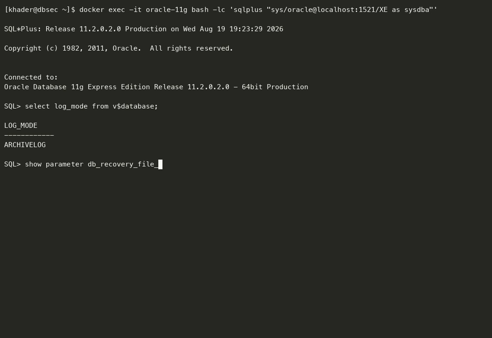
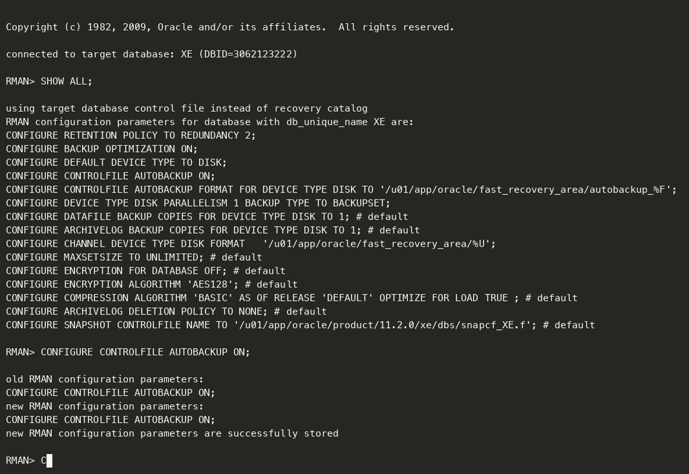
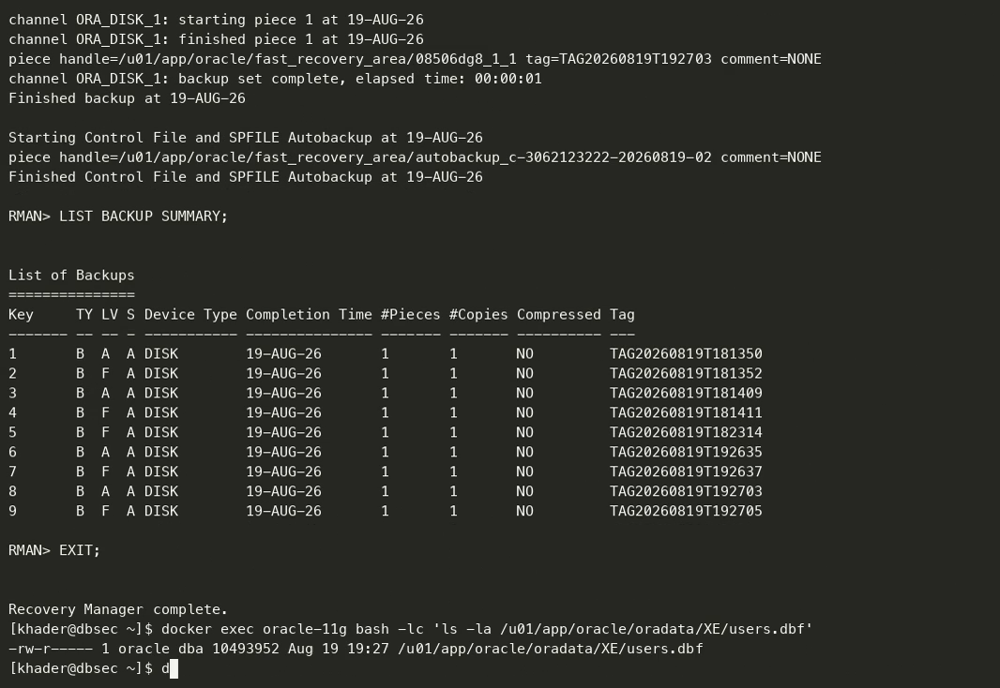
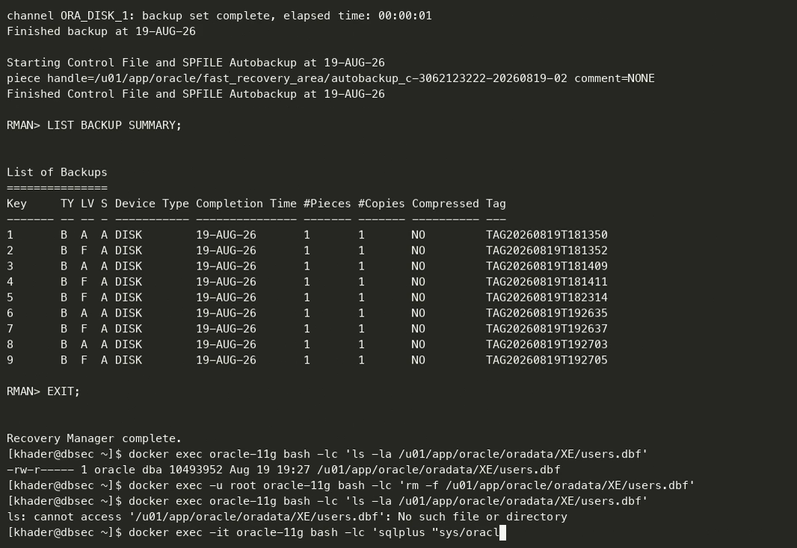
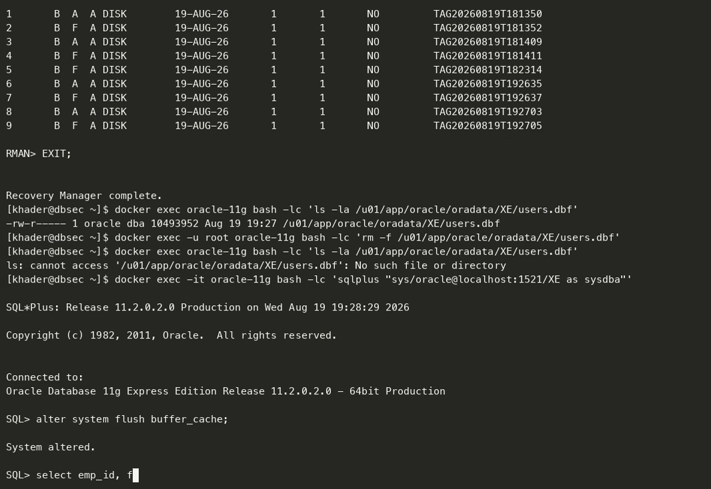
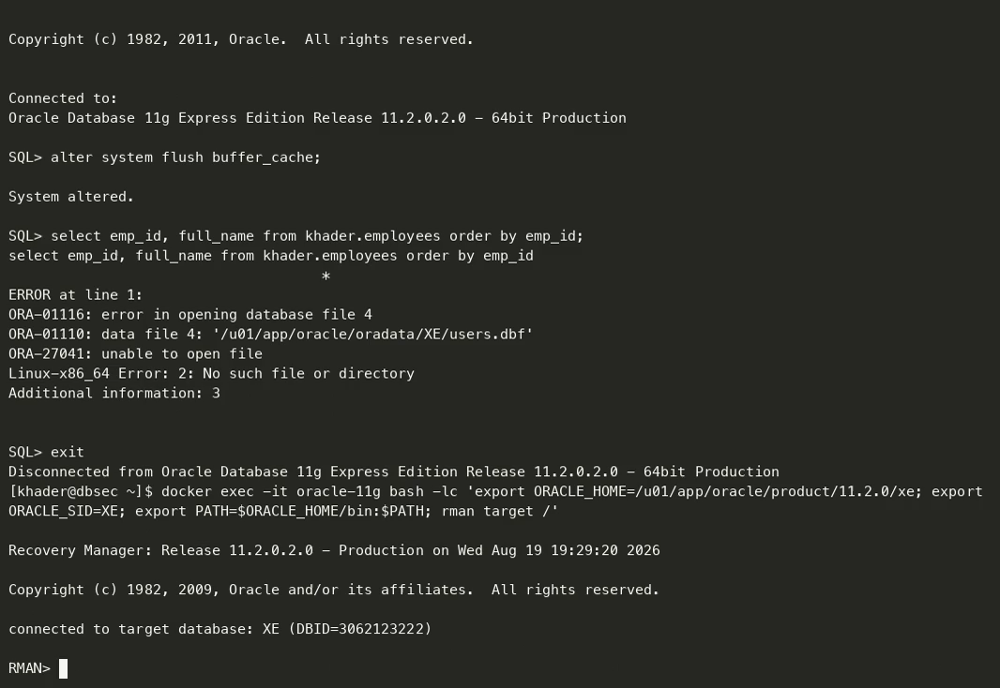
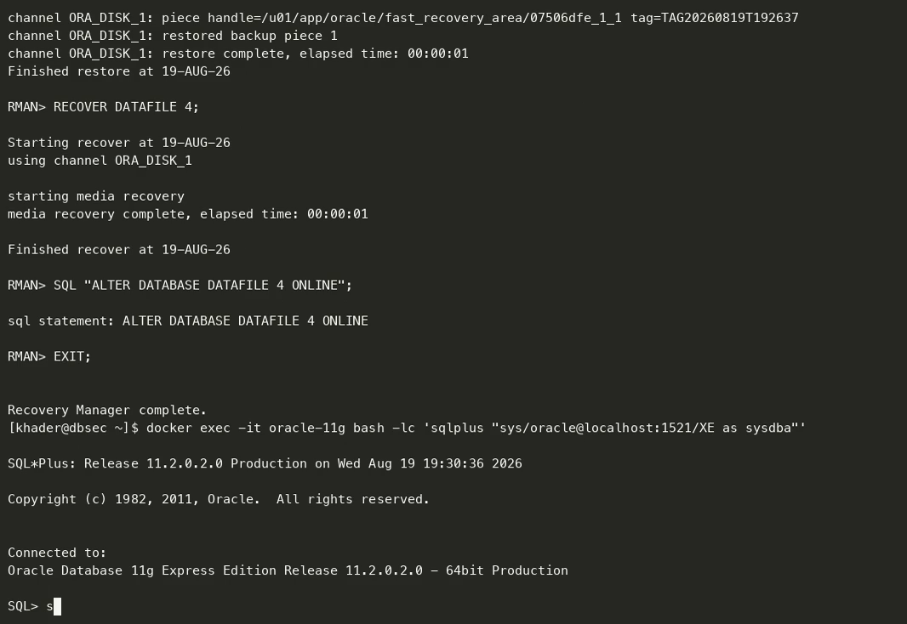
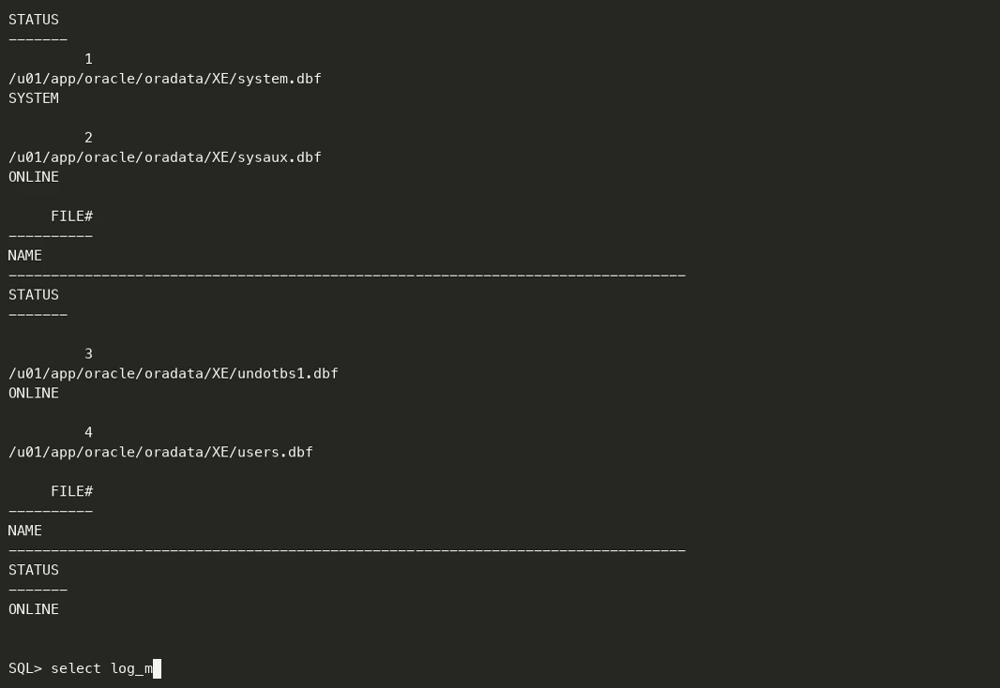
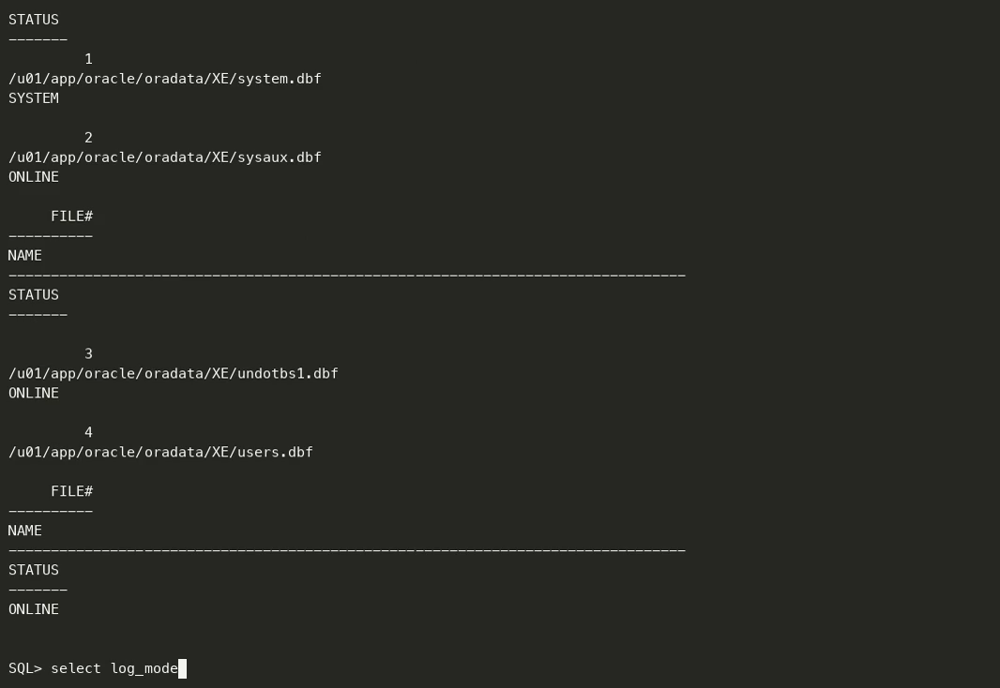

# تقرير المشروع العملي الثالث
## النسخ الاحتياطي والاسترجاع من الكوارث — Backup & Disaster Recovery

| | |
|---|---|
| **المقرر** | أمن قواعد البيانات — Database Security |
| **الطالب** | خضر محمد خضر خضير |
| **الرقم الجامعي** | 120191118 |
| **مدرّس المقرر** | م. أحمد شعث |
| **التاريخ** | 19 أغسطس 2026 |

---

## 1. بيئة العمل

| البند | القيمة |
|---|---|
| نظام إدارة قاعدة البيانات | Oracle Database 11g Express Edition 11.2.0.2.0 — 64bit Production |
| اسم القاعدة (SID) | `XE` |
| أداة النسخ الاحتياطي | Recovery Manager (RMAN) Release 11.2.0.2.0 |
| منطقة الاسترجاع السريع | `/u01/app/oracle/fast_recovery_area` |

**السيناريو المُختار:** فقدان ملف بيانات مساحة الجداول `USERS`، وهو الملف الذي يحتوي مخطط
`KHADER` أي بيانات العمل الفعلية. اختير هذا الملف تحديدًا لأن فقدانه يمثّل كارثة حقيقية على
البيانات، وفي الوقت نفسه لا يُسقط النسخة بالكامل كما يحدث عند فقدان ملف `SYSTEM`، مما يسمح
بتنفيذ الاسترجاع والقاعدة تعمل.

---

## 2. أولًا: إعدادات النسخ الاحتياطي (Backup Configuration)

### 2.1 تهيئة منطقة الاسترجاع السريع (Fast Recovery Area)

سجلات الإعادة المؤرشفة والنسخ التلقائية لملف التحكم تحتاج وجهة مخصّصة. وبدونها يلجأ أوراكل
إلى `$ORACLE_HOME/dbs` وهو ليس مكانًا سليمًا للنسخ الاحتياطي.

```sql
ALTER SYSTEM SET db_recovery_file_dest_size = 3G SCOPE = BOTH;
ALTER SYSTEM SET db_recovery_file_dest = '/u01/app/oracle/fast_recovery_area' SCOPE = BOTH;
```

```
System altered.
```

### 2.2 تفعيل وضع الأرشفة (ARCHIVELOG Mode)

الحالة الابتدائية للقاعدة هي `NOARCHIVELOG`، وفيها تُكتب سجلات الإعادة بشكل دائري ويُعاد
استخدامها، فلا يمكن إجراء نسخ احتياطي والقاعدة مفتوحة، ولا يمكن الاسترجاع إلى نقطة زمنية.
تفعيل `ARCHIVELOG` هو ما يجعل النسخ الاحتياطي بـ RMAN والاسترجاع الحقيقي ممكنَين أصلًا.

**التبديل يتطلّب أن تكون القاعدة في وضع MOUNT وليست مفتوحة:**

```sql
SELECT log_mode FROM v$database;
```

```
LOG_MODE
------------
NOARCHIVELOG
```

```sql
SHUTDOWN IMMEDIATE;
STARTUP MOUNT;
ALTER DATABASE ARCHIVELOG;
ALTER DATABASE OPEN;
```

```
Database closed.
Database dismounted.
ORACLE instance shut down.
ORACLE instance started.
Database mounted.
Database altered.
Database altered.
```

**التحقق:**

```sql
SELECT log_mode FROM v$database;
```

```
LOG_MODE
------------
ARCHIVELOG
```

### 2.3 توليد سجلات مؤرشفة والتحقق منها

```sql
ALTER SYSTEM SWITCH LOGFILE;
ALTER SYSTEM ARCHIVE LOG CURRENT;

SELECT sequence#, name, status FROM v$archived_log ORDER BY sequence#;
```

```
 SEQUENCE# NAME                                                                          S
---------- ----------------------------------------------------------------------------- -
        16 /u01/app/oracle/fast_recovery_area/XE/archivelog/2026_08_19/o1_mf_1_16_o8cwl04w_.arc  A
        17 /u01/app/oracle/fast_recovery_area/XE/archivelog/2026_08_19/o1_mf_1_17_o8cwl101_.arc  A
```

الحالة `A` تعني `AVAILABLE`، أي أن السجلات المؤرشفة مكتوبة ومتاحة للاسترجاع.



> **[لقطة شاشة 1]** — الانتقال من `NOARCHIVELOG` إلى `ARCHIVELOG`.


> **[لقطة شاشة 2]** — قائمة السجلات المؤرشفة في منطقة الاسترجاع السريع.

### 2.4 إعدادات RMAN

```rman
RMAN> CONFIGURE RETENTION POLICY TO REDUNDANCY 2;
RMAN> CONFIGURE CONTROLFILE AUTOBACKUP ON;
RMAN> CONFIGURE CONTROLFILE AUTOBACKUP FORMAT FOR DEVICE TYPE DISK TO
        '/u01/app/oracle/fast_recovery_area/autobackup_%F';
RMAN> CONFIGURE DEFAULT DEVICE TYPE TO DISK;
RMAN> CONFIGURE DEVICE TYPE DISK PARALLELISM 1 BACKUP TYPE TO BACKUPSET;
RMAN> CONFIGURE CHANNEL DEVICE TYPE DISK FORMAT
        '/u01/app/oracle/fast_recovery_area/%U';
RMAN> CONFIGURE BACKUP OPTIMIZATION ON;
```

| الإعداد | الغرض |
|---|---|
| `RETENTION POLICY TO REDUNDANCY 2` | الاحتفاظ بنسختين كاملتين قبل اعتبار الأقدم قابلة للحذف |
| **`CONTROLFILE AUTOBACKUP ON`** | **مطلوب في نصّ المشروع** — نسخ ملف التحكم و`SPFILE` تلقائيًا بعد كل نسخة احتياطية وبعد أي تغيير هيكلي. بدونه يصبح فقدان ملف التحكم كارثة لا يمكن البدء منها |
| `BACKUP OPTIMIZATION ON` | عدم إعادة نسخ الكتل التي لم تتغيّر |



> **[لقطة شاشة 3]** — مخرجات `SHOW ALL` بعد الإعدادات.

---

## 3. ثانيًا: تنفيذ النسخ الاحتياطي الكامل (Full Backup)

```rman
RMAN> BACKUP DATABASE PLUS ARCHIVELOG;
```

**لماذا `PLUS ARCHIVELOG`؟** لأن نسخة ملفات البيانات وحدها لا تكفي: الاسترجاع يحتاج سجلات
الإعادة المؤرشفة ليُعيد تشغيل التغييرات التي حدثت بعد لحظة أخذ النسخة، وبدونها لا يمكن الوصول
إلى حالة متّسقة.

```
channel ORA_DISK_1: backup set complete, elapsed time: 00:00:15
Finished backup at 19-AUG-26
piece handle=/u01/app/oracle/fast_recovery_area/0350697h_1_1 tag=TAG20260819T181409
channel ORA_DISK_1: backup set complete, elapsed time: 00:00:01
Finished backup at 19-AUG-26
piece handle=/u01/app/oracle/fast_recovery_area/autobackup_c-3062123222-20260819-00
```

لاحظ السطر الأخير: النسخة التلقائية لملف التحكم `autobackup_c-...` نُفّذت **تلقائيًا** نتيجة
الإعداد `CONTROLFILE AUTOBACKUP ON`.

```rman
RMAN> LIST BACKUP SUMMARY;
```

```
List of Backups
===============
Key     TY LV S Device Type Completion Time #Pieces #Copies Compressed Tag
------- -- -- - ----------- --------------- ------- ------- ---------- ---
1       B  A  A DISK        19-AUG-26       1       1       NO         TAG20260819T181350
2       B  F  A DISK        19-AUG-26       1       1       NO         TAG20260819T181352
3       B  A  A DISK        19-AUG-26       1       1       NO         TAG20260819T181409
4       B  F  A DISK        19-AUG-26       1       1       NO         TAG20260819T181411
```

`TY = B` نسخة احتياطية، و`LV = A` أرشيف و`F` كامل، و`S = A` تعني `AVAILABLE`.



> **[لقطة شاشة 4]** — تنفيذ `BACKUP DATABASE PLUS ARCHIVELOG` واكتماله.


> **[لقطة شاشة 5]** — `LIST BACKUP SUMMARY`.

---

## 4. ثالثًا: سيناريو الكارثة والاسترجاع (Disaster Recovery)

### 4.1 البيانات قبل الكارثة

```sql
SELECT emp_id, full_name, dept FROM khader.employees ORDER BY emp_id;
```

```
    EMP_ID FULL_NAME            DEPT
---------- -------------------- ----------
      1001 Khader Khudair       Security
      1002 Sara Ahmed           Finance
      1003 Omar Nabil           HR
      1004 Test User            IT
```

```bash
ls -la /u01/app/oracle/oradata/XE/users.dbf
```

```
-rw-r----- 1 oracle dba 10493952 Aug 19 18:14 /u01/app/oracle/oradata/XE/users.dbf
```

### 4.2 الكارثة — حذف ملف البيانات على مستوى نظام التشغيل

لم يُحذف أي شيء بأوامر SQL. الملف أُزيل من القرص تحت قاعدة بيانات تعمل، تمامًا كما يحدث في
حالة حذف بالخطأ أو عطل في القرص:

```bash
rm -f /u01/app/oracle/oradata/XE/users.dbf
ls -la /u01/app/oracle/oradata/XE/users.dbf
```

```
ls: cannot access '/u01/app/oracle/oradata/XE/users.dbf': No such file or directory
```

**أثر الكارثة على القاعدة:**

```sql
ALTER SYSTEM FLUSH BUFFER_CACHE;
SELECT emp_id, full_name FROM khader.employees ORDER BY emp_id;
```

```
ERROR at line 1:
ORA-01116: error in opening database file 4
ORA-01110: data file 4: '/u01/app/oracle/oradata/XE/users.dbf'
ORA-27041: unable to open file
Linux-x86_64 Error: 2: No such file or directory
```

> **ملاحظة مهمة:** استُخدم `FLUSH BUFFER_CACHE` عمدًا. فبدونه قد تُخدَم البيانات من الذاكرة
> ويبدو الأمر وكأن شيئًا لم يحدث، فيكون إثبات الكارثة غير حقيقي.



> **[لقطة شاشة 6]** — البيانات قبل الحذف ووجود الملف.


> **[لقطة شاشة 7]** — الخطأ `ORA-01116 / ORA-01110` بعد الحذف.

### 4.3 الاسترجاع بـ RMAN

```rman
RMAN> SQL "ALTER DATABASE DATAFILE 4 OFFLINE";
RMAN> RESTORE DATAFILE 4;
RMAN> RECOVER DATAFILE 4;
RMAN> SQL "ALTER DATABASE DATAFILE 4 ONLINE";
```

```
Starting restore at 19-AUG-26
channel ORA_DISK_1: restoring datafile 00004 to /u01/app/oracle/oradata/XE/users.dbf
channel ORA_DISK_1: reading from backup piece /u01/app/oracle/fast_recovery_area/02506971_1_1
Finished restore at 19-AUG-26

Starting recover at 19-AUG-26
starting media recovery
media recovery complete, elapsed time: 00:00:01
Finished recover at 19-AUG-26
```

**الفرق بين الخطوتين — وهذا جوهر المشروع:**

| الخطوة | ماذا تفعل |
|---|---|
| `RESTORE` | تُعيد نسخ ملف البيانات من النسخة الاحتياطية إلى مكانه على القرص. الملف يعود لكنه **قديم**، أي بحالة لحظة أخذ النسخة |
| `RECOVER` | تُطبّق سجلات الإعادة المؤرشفة التي كُتبت **بعد** تلك النسخة، فيلحق الملف ببقية القاعدة ويصبح متّسقًا معها |

ولو كانت القاعدة في وضع `NOARCHIVELOG` لما وُجدت تلك السجلات، ولضاعت كل التغييرات التي تلت
النسخة الاحتياطية. **وهذا هو السبب الحقيقي لوجود وضع الأرشفة.**

### 4.4 التحقق بعد الاسترجاع

```sql
SELECT emp_id, full_name, dept FROM khader.employees ORDER BY emp_id;
```

```
    EMP_ID FULL_NAME            DEPT
---------- -------------------- ----------
      1001 Khader Khudair       Security
      1002 Sara Ahmed           Finance
      1003 Omar Nabil           HR
      1004 Test User            IT
```

```sql
SELECT file#, name, status FROM v$datafile ORDER BY file#;
```

```
     FILE# NAME                                            STATUS
---------- ----------------------------------------------- -------
         1 /u01/app/oracle/oradata/XE/system.dbf           SYSTEM
         2 /u01/app/oracle/oradata/XE/sysaux.dbf           ONLINE
         3 /u01/app/oracle/oradata/XE/undotbs1.dbf         ONLINE
         4 /u01/app/oracle/oradata/XE/users.dbf            ONLINE
```

✅ **عادت البيانات الأربعة كاملة، وعاد ملف البيانات إلى الحالة `ONLINE`.**

> **دليلٌ إضافي مهم للمناقشة:** الصف رقم `1004` والقسم `Security` للموظف `1001` لم يكونا موجودَين
> في البيانات الأصلية، بل كُتبا أثناء اختبارات المشروعين الأول والثاني. وظهورهما بعد الاسترجاع
> يثبت أن `RECOVER` طبّق سجلات الإعادة فعلًا، ولم يكتفِ بإعادة نسخة قديمة من الملف.



> **[لقطة شاشة 8]** — تنفيذ `RESTORE` و`RECOVER`.


> **[لقطة شاشة 9]** — عودة البيانات وحالة `ONLINE` لملف البيانات.

---

## 5. ملاحظة على Flashback Database

يتناول المقرر أيضًا خاصية `FLASHBACK DATABASE` (ملف `Flashback database.txt`). وهذه الخاصية
**غير متاحة في نسخة Express Edition**:

```sql
SELECT parameter, value FROM v$option WHERE parameter = 'Flashback Database';
```

```
PARAMETER                  VALUE
-------------------------- ------
Flashback Database         FALSE
```

ونصّ المشروع لا يطلبها؛ فالمطلوب هو إعدادات النسخ الاحتياطي، والنسخة الكاملة، وسيناريو
استرجاع — وقد نُفّذت جميعها بـ RMAN وهي وظائف أساسية في المنتج وليست خصائص مرخّصة.

---

## 6. الخلاصة

| المتطلب | الحالة | الدليل |
|---|---|---|
| تفعيل ARCHIVELOG Mode | ✅ | `LOG_MODE` انتقل من `NOARCHIVELOG` إلى `ARCHIVELOG` |
| إعدادات RMAN | ✅ | `SHOW ALL` بعد سبعة أوامر `CONFIGURE` |
| Control File Autobackup | ✅ | `autobackup_c-3062123222-20260819-00` أُنشئ تلقائيًا |
| إعدادات أخرى ضرورية | ✅ | منطقة الاسترجاع السريع 3G |
| النسخ الاحتياطي الكامل | ✅ | `BACKUP DATABASE PLUS ARCHIVELOG` — 4 نسخ في `LIST BACKUP` |
| سيناريو استرجاع من كارثة | ✅ | حذف `users.dbf` ثم `RESTORE` + `RECOVER` بلا أي خطأ |

**أهم النقاط للمناقشة:**

1. لا يمكن تفعيل `ARCHIVELOG` والقاعدة مفتوحة — يجب `STARTUP MOUNT`.
2. `RESTORE` تُعيد الملف، و`RECOVER` تُطبّق سجلات الإعادة. الأولى وحدها تعني فقدان كل ما تلا النسخة.
3. `CONTROLFILE AUTOBACKUP` يحمي من فقدان ملف التحكم، وهو أصعب سيناريو للاسترجاع بدونه.
4. `PLUS ARCHIVELOG` ليست رفاهية: بدون السجلات المؤرشفة لا يمكن الوصول إلى حالة متّسقة.
5. أُخذ الملف `OFFLINE` قبل الاسترجاع ليبقى باقي القاعدة يعمل أثناء الإصلاح.
